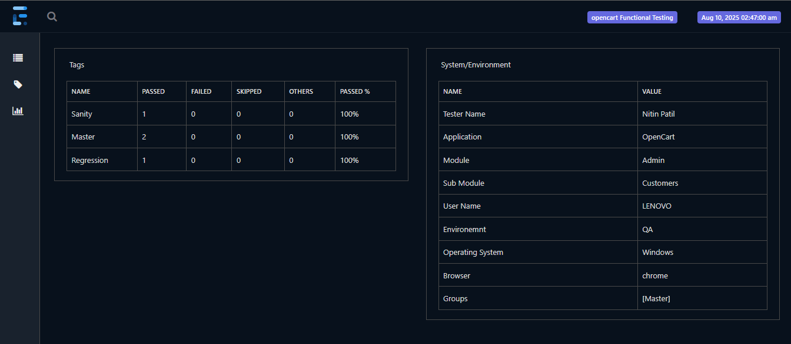
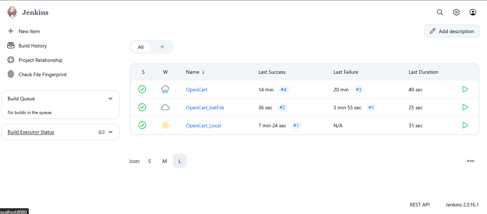

Perfect 👍 you’ve shared a full **framework structure**. Let’s create a professional **`README.md`** for your GitHub project. This will help others (and you in future) to quickly understand and run the framework.

Here’s a clean draft:

---

# 🚀 OpenCart UI Automation Framework


## 📌 Overview

This project is a **Hybrid Automation Framework** built for automating the **OpenCart** application using **Selenium, TestNG, Maven, Docker, and Jenkins**.

The framework supports:

* ✅ Page Object Model (POM) design pattern
* ✅ Data-driven testing (Excel-based)
* ✅ Cross-browser execution
* ✅ Parallel execution with Selenium Grid & Docker
* ✅ Jenkins CI/CD integration
* ✅ Extent Reporting & Screenshot on Failure

---

## 📂 Project Structure

```
├── ProjectImage/                  → Framework screenshots
├── TestData/                      → Test data files (Excel)
├── src/test/java/                 → Test scripts & page objects
│   ├── pageObjects/               → POM classes
│   ├── testBase/                  → Base setup class
│   ├── testCases/                 → TestNG test cases
│   └── utilities/                 → Helper classes (Excel, Reports)
├── src/test/resources/            → Config & log4j files
├── reports/                       → HTML Extent Reports
├── screenshots/                   → Captured screenshots on failures
├── logs/                          → Log4j execution logs
├── test-output/                   → TestNG default reports
├── docker-compose.yaml            → Docker Grid setup
├── docker-grid.xml                → Grid execution config
├── pom.xml                        → Maven dependencies & plugins
├── master.xml                     → Master TestNG suite
├── run.bat                        → Batch file for execution
└── README.md                      → Project documentation
```

---

## ⚙️ Tech Stack

* **Language**: Java
* **Build Tool**: Maven
* **Test Framework**: TestNG
* **Automation Tool**: Selenium WebDriver
* **Logging**: Log4j2
* **Reporting**: Extent Reports + TestNG HTML Reports
* **CI/CD**: Jenkins
* **Containerization**: Docker + Selenium Grid

---

## 🛠️ Setup & Execution

### 1️⃣ Clone the repository

```bash
git clone https://github.com/<your-username>/OpenCartUIAutomation.git
cd OpenCartUIAutomation
```

### 2️⃣ Install dependencies

Make sure you have **Maven** installed. Run:

```bash
mvn clean install
```

### 3️⃣ Run Tests

* **Default suite**

```bash
mvn clean test
```

* **Specific TestNG XML**

```bash
mvn clean test -DsuiteXmlFile=testng.xml
mvn clean test -DsuiteXmlFile=master.xml
mvn clean test -DsuiteXmlFile=crossbrowser.xml
```

* **Using run.bat**
  Double-click `run.bat` or from terminal:

```bash
run.bat
```

---

## 🐳 Docker + Selenium Grid Execution

1. Start Selenium Grid using Docker Compose:

```bash
docker-compose up -d
```

2. Run tests on Grid:

```bash
mvn clean test -DsuiteXmlFile=docker-grid.xml
```

---

## 📊 Reports & Logs

* **Extent Reports**: `reports/`
* **Screenshots on Failure**: `screenshots/`
* **Log file**: `logs/automation.log`
* **TestNG Reports**: `test-output/`



---

## 🔄 CI/CD with Jenkins

1. Install Jenkins & configure Maven + Git in `Global Tool Configuration`
2. Create a new Jenkins Job → Pull this repo
3. Add **Build Step**:

   ```bash
   mvn clean test -DsuiteXmlFile=master.xml
   ```
4. View execution & reports in Jenkins



---

## 📝 Test Cases Implemented

* **TC001\_AccountRegistrationTest** → Validate account registration
* **TC002\_LoginTest** → Validate login with valid credentials
* **TC003\_DDTLogin** → Validate login with multiple data sets (Excel-driven)

---

## 📌 Future Enhancements

* Integrate with **Allure Reports**
* Add support for **API Testing**
* Enable **Cloud Execution** (BrowserStack/SauceLabs)

---

✨ Author: **Nitin Patil (SDET)**

---

Would you like me to also add **badges** (like Maven build, Docker, Jenkins, TestNG) at the top of the README for a more professional GitHub look?
